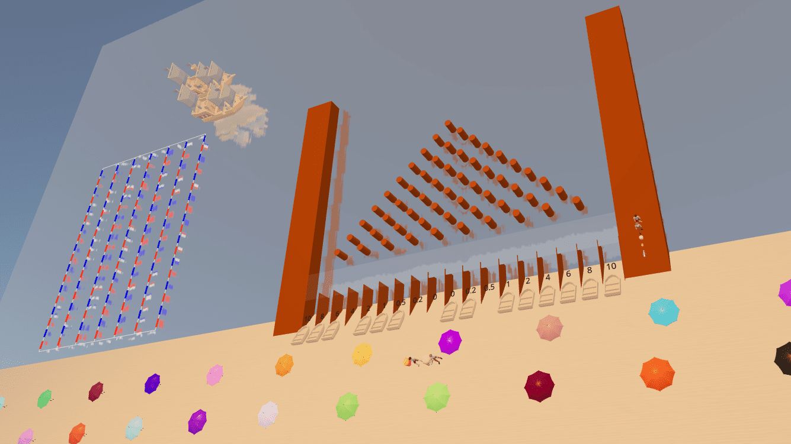

# Plinko



Play without the fear of losing your money! This site offers an offline balance and an online balance. Both balances only allow the user to claim 100 points every 24 hours. Online balance API is hosted on this site and utilizes the login system of Articles Media to authenticate users.

## Getting Started

First, run the development server:

```bash
npm run dev
```

## Online States and Balance

Handled by a MongoDB database, schema available inside db-schema.js

## Attributions

[Ship Model (Kenney)](https://kenney.nl/assets/pirate-kit)

[Food Models (Quaternius)](https://quaternius.com/packs/junkfood.html)

[People Models (Quaternius)](https://quaternius.com/packs/ultimatemodularcharacters.html)

[Building Models (JToastie)](https://poly.pizza/u/J-Toastie)

[Beach Ball Texture](https://github.com/Articles-Joey/plinko)

[Wood Texture](https://github.com/Articles-Joey/plinko)

[Beach Ball Icon](https://www.flaticon.com/free-icon/beach-ball_10725946)

## Inspiration

...